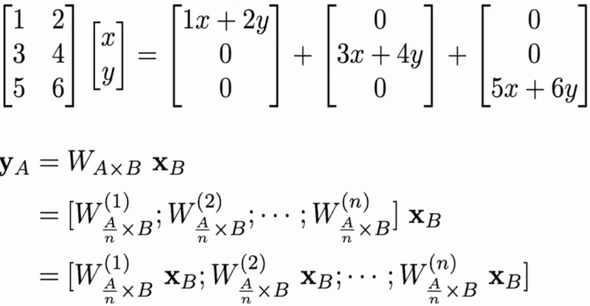
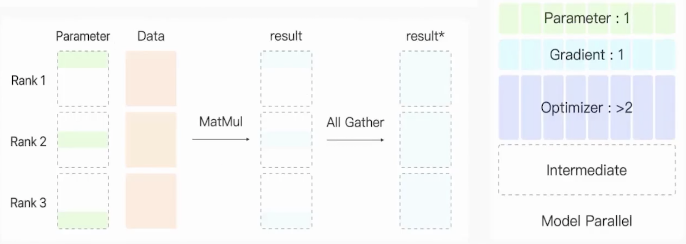
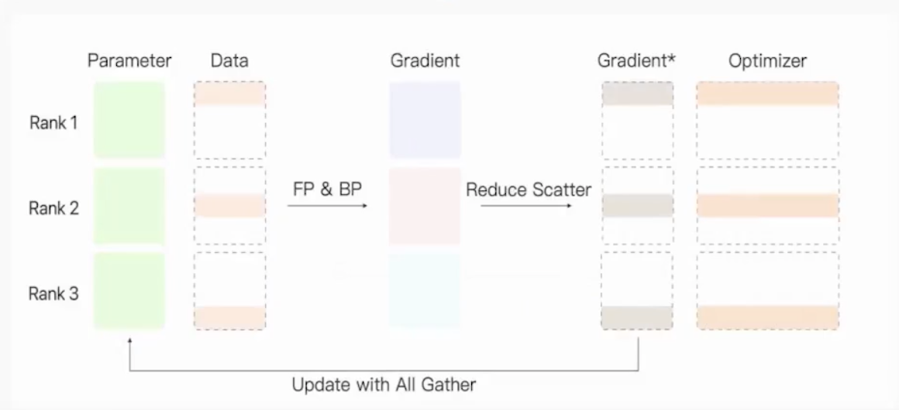
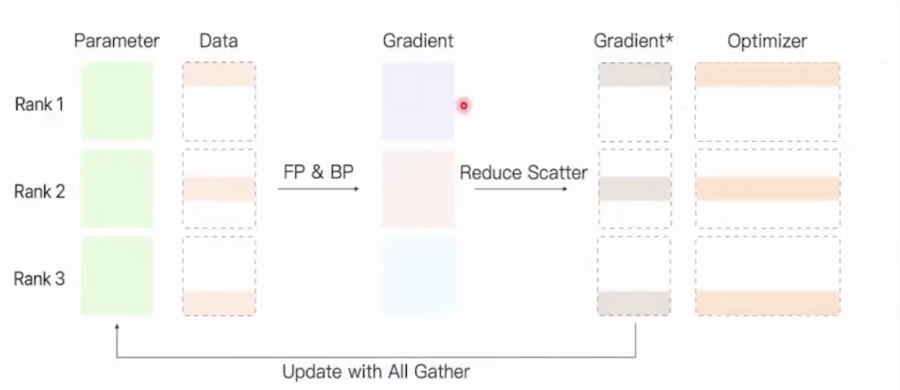
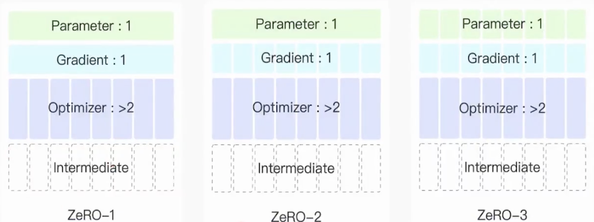

## 模型并行
### 矩阵拆分

### 模型拆分

先把输入要划分到多张显卡上，需要保证模型的输入是一样的，那么就不能采用数据并行的方式。所以他们是同样的一批数据。all gather进行拼接。
每张显卡只需要保存模型的1/n的模型参数。n是gpu的个数。参数、梯度、优化器相应的减少。线性层输入是根原来一致的。

## Zero Redundant Optimizer

### ZeRO-Stage1

每张显卡有相同参数，不同的数据进行规约，然后发送到各张显卡上的梯度相同。各自去进行参数优化。
相同的参数，相同的梯度，需要重复计算n次，带来计算重复和冗余。
每张显卡上只去获取一部分的梯度，然后只需更新一部分的参数，这样我们各张显卡可以合作，最后他们进行一个交流，就能把模型的完整的梯度恢复出来。
每张显卡需要保存完整的参数。
1号显卡得到规约梯度的前面1/3
2号显卡得到规约梯度的中间1/3
3号显卡得到规约提的的后面1/3
1号显卡和前1/3的梯度对应的optimizer，取更新前1/3的模型参数。2号3号同理。把每张显卡的分工合作的结果，进行收集和拼接。每张显卡又得到完全一样的参数和一致的结果。

### ZeRO-Stage2

在第一个阶段，需要在反向传播得到所有梯度之后，我们对这个梯度进行Reduce Scatter，得到这个Gradient*之后，原来Gradient，就没有用了，就可以移除。
在Zero的stage1，反向传播结束之后才会把Gradient进行移除。
在反向传播的过程中就可以把Gradient*进行提前算出来，然后把Gradient进行移除。
假如我们有24层的transformer，我们就用第24层的各卡上的梯度。进行Reduce Scatter，之后第24层的梯度就可以不要了，然后再进行23层的Reduce Scatter，得到第23层的Gradient*，
这个时候我们就可以只保存第23层的Gradient*到显卡上。然后把第23层的Gradient进行移除。这样我们把Gradient移除的操作提前了，节省显存空间。

### ZeRO-stage3

对模型的参数进行了划分
在Zero的第二个阶段和第一个阶段中，它都没有避免前面模型并行，所解决的问题。模型的参数仍然需要完整的保存在我们的显卡里面；
为了解决这个问题，需要把模型进行划分。
因为每张显卡上我们只保留了，一部分的梯度进行参数更新，参数更新也只能更新一部分的模型参数。实际上模型显卡就可以只保存他自己的参数更新。他自己所负责的参数。
所以，每张显卡有一部分参数一部分梯度和一部分优化器。
如何进行前向传播和

反向传播过程中，我们需要一个All Gather的操作，用到模型的所有参数的时候。我们临时的把每张显卡上的那一部分参数进行一个收集拼接。
每当用完的时候，我们就把这个参数给从显卡上释放。
具体而言，在Transform中我们遇到了一个线性层，这个线性层的参数可能被分到了三张显卡上，
这个时候需要计算线性层的时候，我们临时把跟这个线性层有关的那一部分参数从各张显卡上收集起来，进行一个线性层的计算。
计算完成之后，我们的模型参数就不需要放到显卡里面了，又可以释放了。又恢复成每张显卡只保留一部分线性层参数的这样的一个模式。

在进行反向传播计算梯度的时候也需要完整的模型参数，也需要gather一下。
相比Zero2他只在参数更新这一步进行了All gather操作。
Zero3在进行前向和反向传播各需要一次All gather操作，实际上是增加了一次通信。
Zero3相比于Zero2是一个用时间换空间的一个算法。

### ZeRO阶段对比

ZeRO1
每张显卡只需要处理一部分模型梯度，优化器降低至原来的卡数分之一。基于ZeRO并行结构，中间结果的量也降低原来的卡数分之一。

ZeRO2
我们进一步将模型划分梯度的划分提前，把Reduce Scatter提前到了反向传播的过程中，实际上不需要保留完整的梯度。每删掉一层就可以把梯度划分到卡数分之一。
ZeRo3
由于每张显卡只负责一部分的参数更新，我们进一步把参数划分，通过3部分的优化之后，显卡上的四大组成部分：参数、梯度、优化器和中间结果都得到了划分，显卡只需要保存这些参数的卡数分之一的部分。

