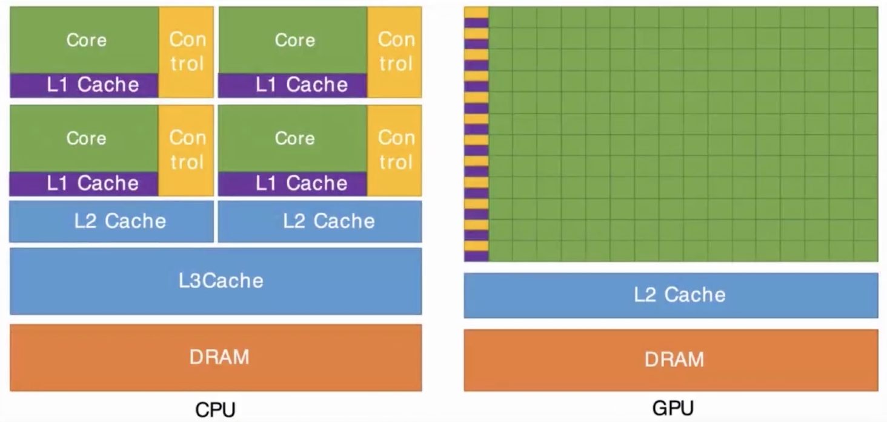
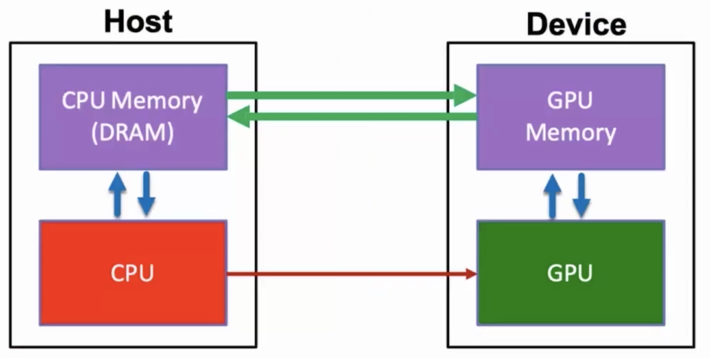
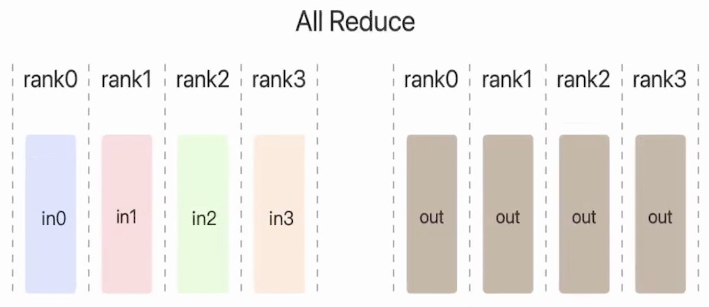
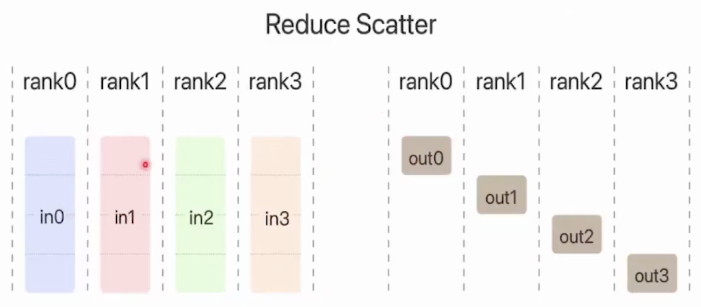
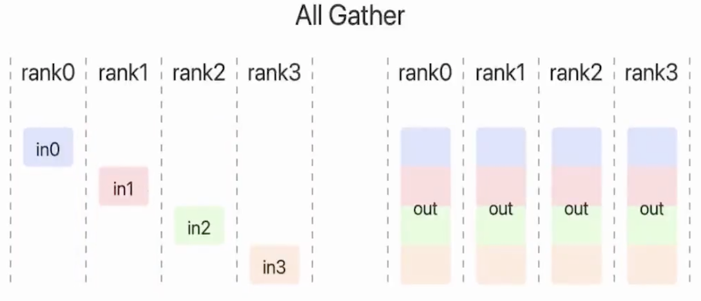

### GPU特点

    
cpu 适合逻辑计算，gpu 大量重复值计算。

在Pytorch中，.cuda 或者to device就是传输到gpu上进行计算。

cpu给gpu发送控制信息，控制gpu进行运算。

|GPU显存存储 | 描述 |其他|
| ---- | ---- | ---- |
| Parameter:1 | 模型参数| 
| Graadient:1 | 梯度  |
| Optimizer:>2 |优化器参数 |
| Intermediate | 线性层 |
| Valilla FineTuning | |

#### adam优化器参数：
$m_t=\beta_1m_{t-1}+(1-\beta_1) g_t$

$v_t=\beta_2m_{t-1}+(1-\beta_2) g^2_t$

g是梯度，模型梯度；模型二次项相关的历史信息分别是m和v。
其中m和v和梯度g等数量级，m和v加起来是两倍参数量。

#### 线性层
Forward : $y=Wx$

Backward: $\nabla_X= W^T \nabla_y$   $\nabla_W=(\nabla_y)X^T$

    解释 ：前向传播，x是输入，w是参数，y是输出结果。为了计算参数的梯度，需要模型输出的梯度与模型输入进行一个外积。为了完成这个计算，需要把模型输入放到显卡里面。在前向传播的过程中，把所有的线性层都先保存到显卡里面。直到反向传播用完则清除。从显卡释放。

##### Broadcast

广播算子，是把一个数据广播到所有其他显卡上。

#### 

reduce，规约
可以求和、取平均。

二号显卡得到的数据是in0+in1+in2+in3

all reduce
所有显卡都会得到相同的out=in0+in1+in2+in3
先进行规约然后在进行广播

reduce scatter
每张显卡只得到一部分的规约结果。

和all reduce区别：都会把自己规约得到结果发给所有
显卡。

不同之处：每张显卡上只得到了一部分的规约结果。
第一个1/4的所有结果。
out0=1/4in0+1/4in1+1/4in2+1/4in3
out1所有第二个1/4的结果。

all Gather
收集所有的结果，然后广播。
in0拼接in1拼接上in2拼接上in3，然后广播给所有显卡。

数据并行

有个参数服务器
参数复制到所有显卡上，
数据划分成3份。分别计算梯度，然后聚合（规约）取平均。
规约结果放到参数服务器上，

分布式数据并行

这个没有参数服务器。

每张显卡都有相同的模型参数。
然后得到一部分数据，

然后通过前向传播和反向传播得到规约的梯度信息。
为了让每张显卡都得到相同的梯度信息。
使用all reduce，每张显卡都能得到规约之后的梯度。

所以每张显卡都有一样的参数和一样的梯度。
分别去使用模型的优化器进行更新。

参数一样，梯度一样，优化器之前的历史信息也一样。
那么更新你之后我们各张显卡上的参数也一样。

